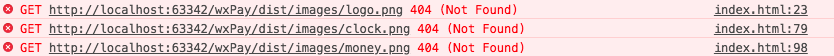

## *webpack* 打包图片资源

#### webpack初涉问题描述：

*使用file-loader（npm install --save-dev file-loader）*

    module: {
            rules: [
                //other rules
                {
                    test: /\.(png|svg|jpg|gif)$/,
                    use: [
                        {
                            loader: 'file-loader',
                            options: {
                                outputPath: 'images/'
                            }
                        }
                    ]
                }
            ]
        }

结果：只有css中用到的图片资源被打包，所以css文件中的背景图片引用正常，但是html中的图片并未打包，img标签报未找到图片资源，👇

#### 问题总结：

    原来HTML页面上的图片引用webpack是不处理的。

    其实官方文档有很明确的给出如何使用 webpack压缩img。第一次看的时候遗漏了，😓

    在html中需使用js动态添加img，

    (不过始终觉得以上方法有些麻烦，😓)

 > 所以 __方法二__ 铛铛铛铛～：

使用 html-loader（npm install html-loader --save-dev）

    webpack.config.js中添加配置:

    {
        test: /\.(html)$/,
        use: {
            loader: 'html-loader',
            options: {
                attrs: [':data-src'],
                // minimize: true
            }
        }
    }

    XX.html 添加 data-src 属性:
    